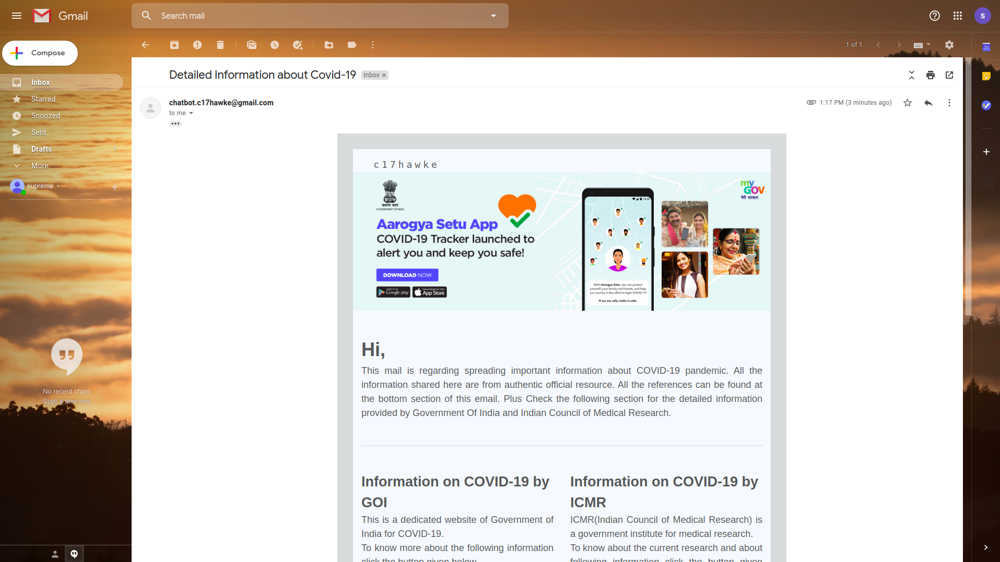

# Covid Responder Lex Bot

As the name suggests this is a chatbot meant to respond COVID-19 pandemic related queries. It is mainly made with the help of amazon's lex module.

It has the following functionalities -
### 1. Answers FAQ about COVID-19 -
Following are the kind of queries that you can ask this chatbot -

* I need information about corona virus ?
* What can I do to protect myself and prevent the spread of disease
* what precautions should I take
* How does COVID spread
* can you tell me about symptoms of corona
* How do I know if it is COVID or just the common flu

### 2. Able to send mail to the users -
It can ask your email id, phone number and name initialy and has the ability to send you a mail which will contain all the details that you need to know about COVID-19. It also sends an attachment of which contains detailed FAQs related to this pandemic.

 </img>

!!! note
    All the details that you get from this chatbot are of from authentic resource. All the references for the same can be found in the email as well as the end of this doc under the reference section 

### 3. Able to give covid cases status -
* PINCODE wise-
It can give give you status as shown below when you ask pincode wise covid case starus- 

<!-- >  -->

 </img>

* Country wise

 </img>

