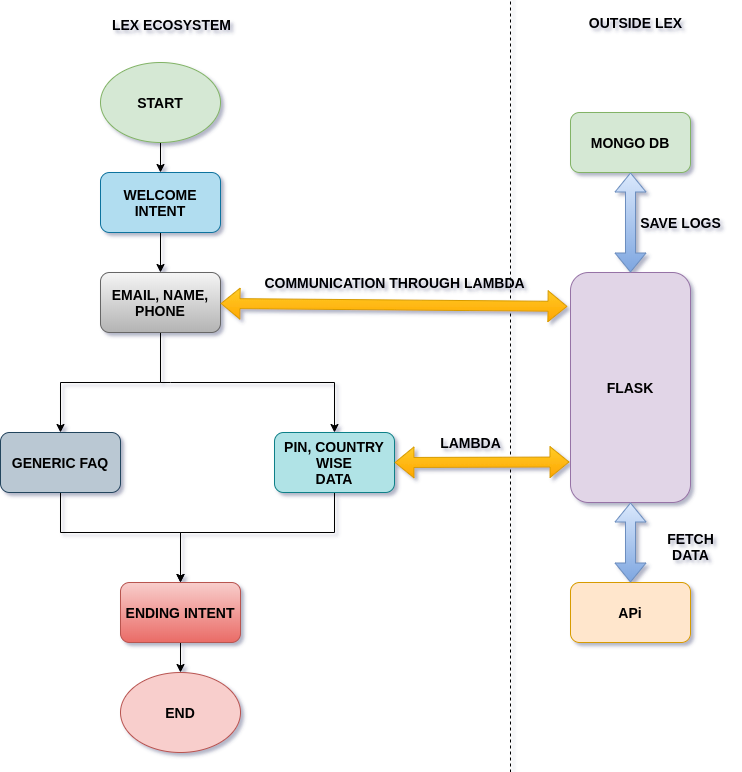

# Project layout and connection

Here we are going to build a chatbot that can answer query related to COVID-19 pandemic. This is mainly going to be a FAQ bot that can basically will have the following functionality - 

- It should be able to show demographic wise covid-19 cases
- It should capture user name
- It should capture user email id
- It should capture user mobile number
- It should capture user pincode
- It should be able to send covid-19 cases to report in detail and prevention measure to user mail id
- It should be integrated with facebook messenger and telegram
- It should be able to save all the conversation In any of databases preferred will be mongodb or any SQL system
- It should show map wise COVID cases in case a user is asking for a worldwide case of covid-19

## Available platfroms to make chatbots- 
To impliment above functionalites we can use any of the below platfroms to impliment our bot -

1. #### Amazon Lex

2. #### Azure Luis

3. #### Google DailogFlow

4. #### Facebooks Wit.ai

5. #### RASA 

All of the has certain pros and cons but for our current project we will be using Amazon Lex.

## Project block daigram and flow - 

