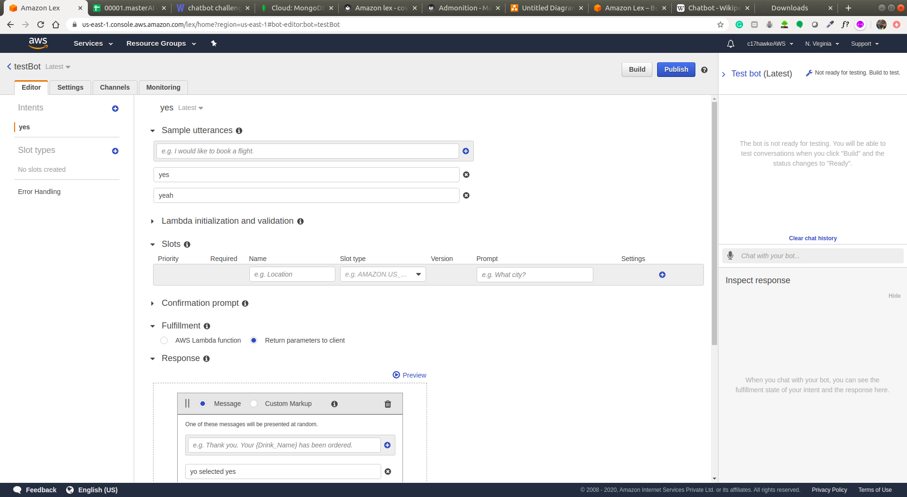
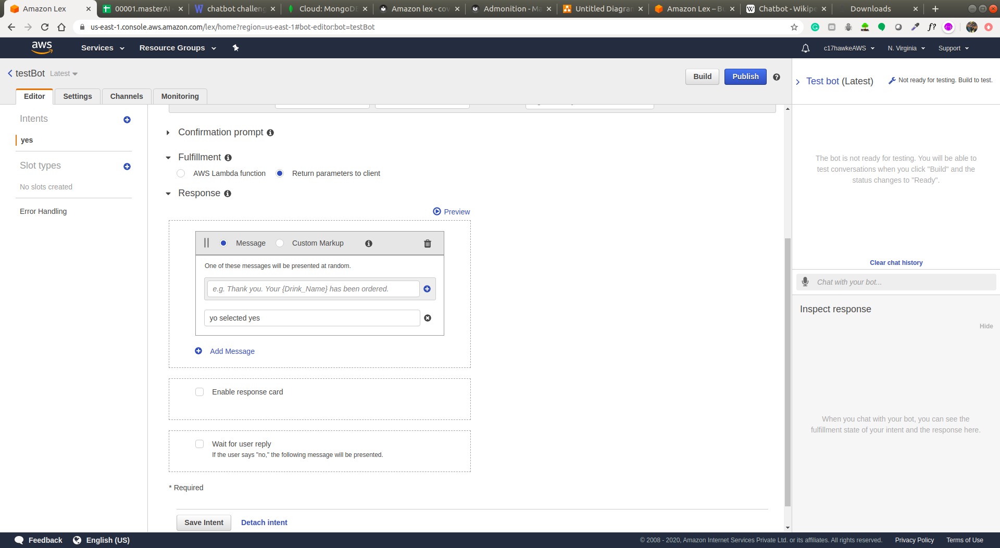
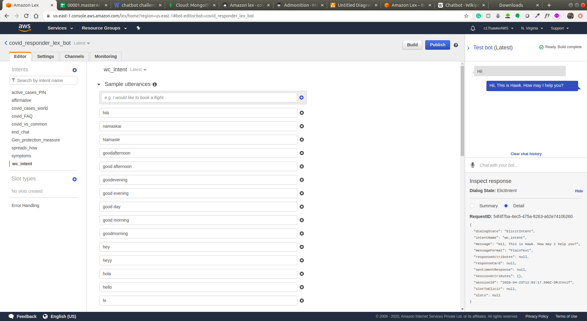
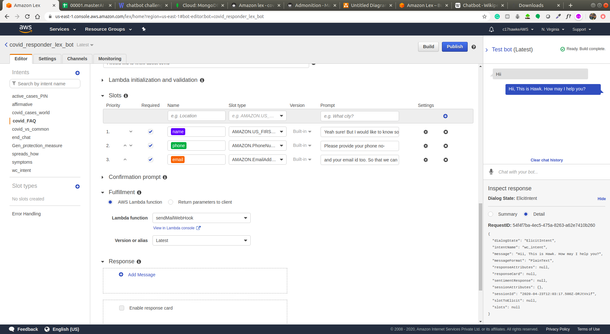
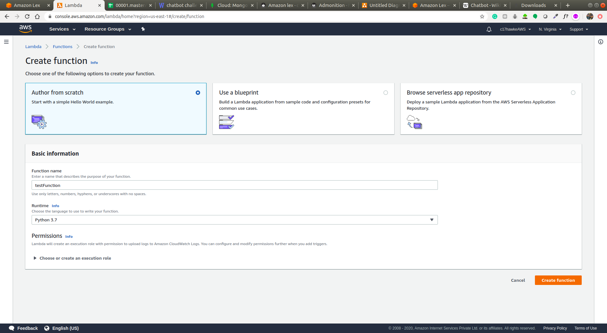
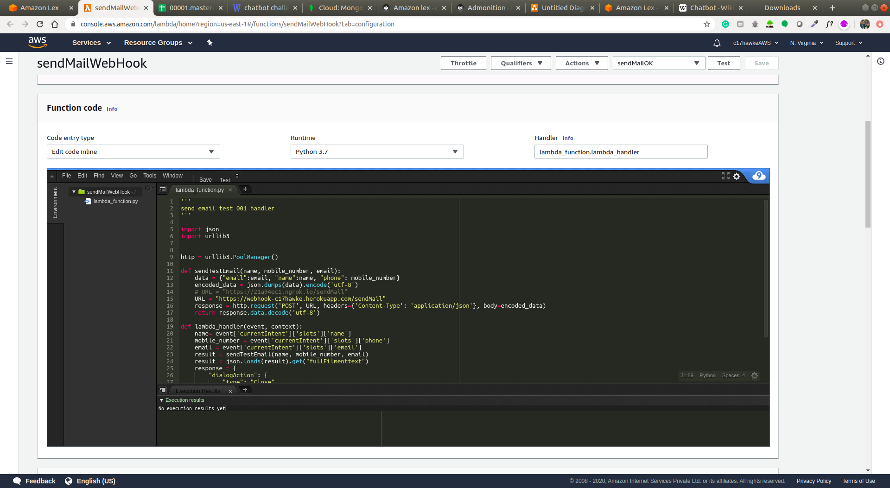
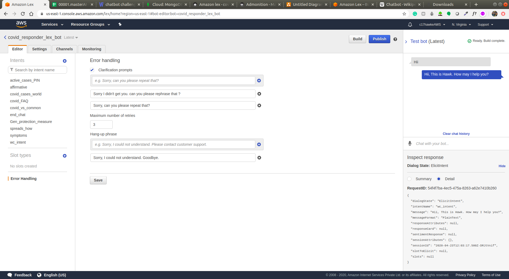

# Amazon lex

## The ecosystem

Lex gives lot of functionalities out of the box. Lets discuss about each of them one by one.

!!! note
    for detailed explaination check the =="Amazon Lex tutorial by iNeuron"== on the Reference page of the docs.

### 1. Lex console-

---

### 2. Create bot-

---

### 3. Bot dashboard-

---

### 4. Create intent-

---

### 5. Response cards and messages-

---

### 6. Create lot of possible Qs for an intent-

---

### 7. Create slots to extract entity-

---

### 8. Create a lambda function as per requirement

---

### 9. Use Lambds function to connect with extenal API-

---

### 10. Test your lambda function output by creating tests-

---

### 11. Multiple response msgs or utterances

---

### 12. Error handling

