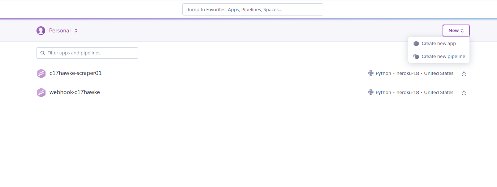

# Deployment on Heroku

Following are the steps to create a new project and deploy on Heroku -

1. ## Login to dashboard
[login](https://dashboard.heroku.com/) to heroku.

2. ## Create an app

    

     


3. ## Follow the instructions given using Heroku CLI

Install the [Heroku CLI](https://devcenter.heroku.com/articles/heroku-command-line)
Download and install the Heroku CLI.

If you haven't already, log in to your Heroku account and follow the prompts to create a new SSH public key.

```
$ heroku login
```

Create a new Git repository
Initialize a git repository in a new or existing directory

```
$ cd my-project/
$ git init
$ heroku git:remote -a test-c17hawke
```

Deploy your application
Commit your code to the repository and deploy it to Heroku using Git.

```
$ git add .
$ git commit -am "make it better"
$ git push heroku master
```

Existing Git repository
For existing repositories, simply add the heroku remote

```
$ heroku git:remote -a test-c17hawke
```

4. ## Before deploying create the following files -
    
    - Procfile
        It should contain the following line- 
        
        !!! note
            web: python app.py


    - requirements.txt
        it should contain all the dependencies mentioned as shown below - 

        !!! note
            APScheduler==3.6.3

            certifi==2019.11.28
            
            Click==7.0
            
            colorhash==1.0.2
            
            configparser==4.0.2

            Flask==1.1.1
